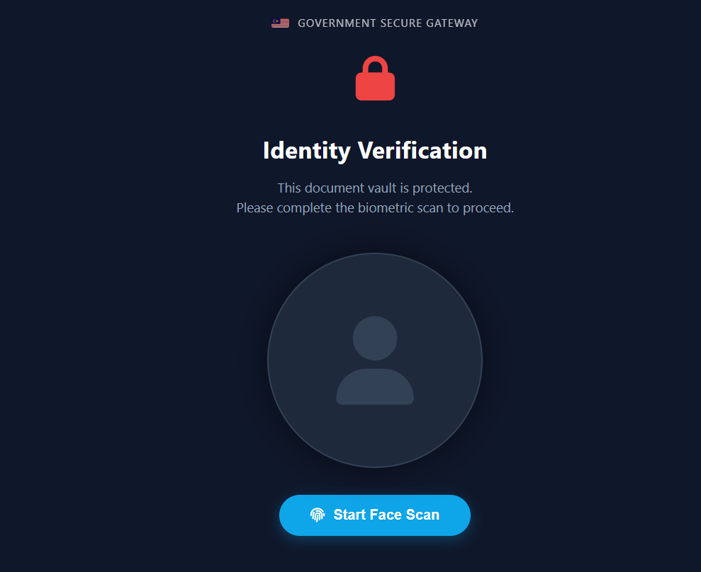
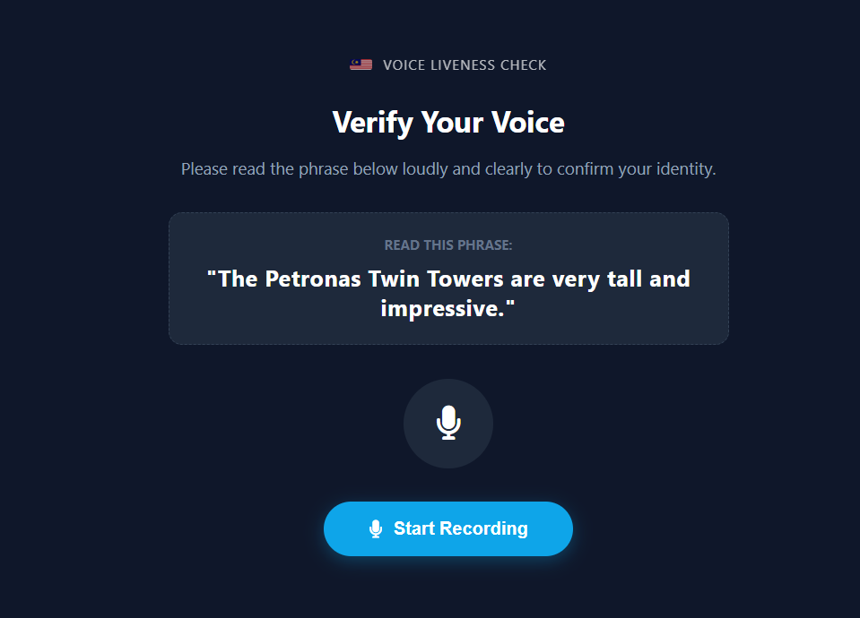
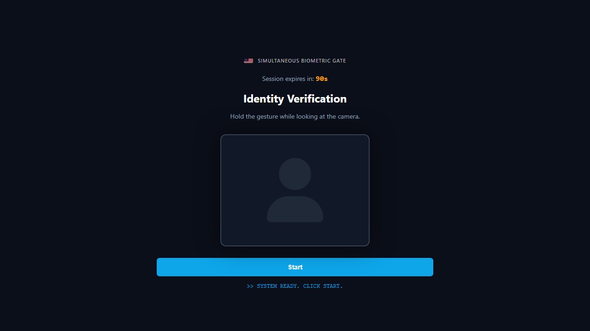
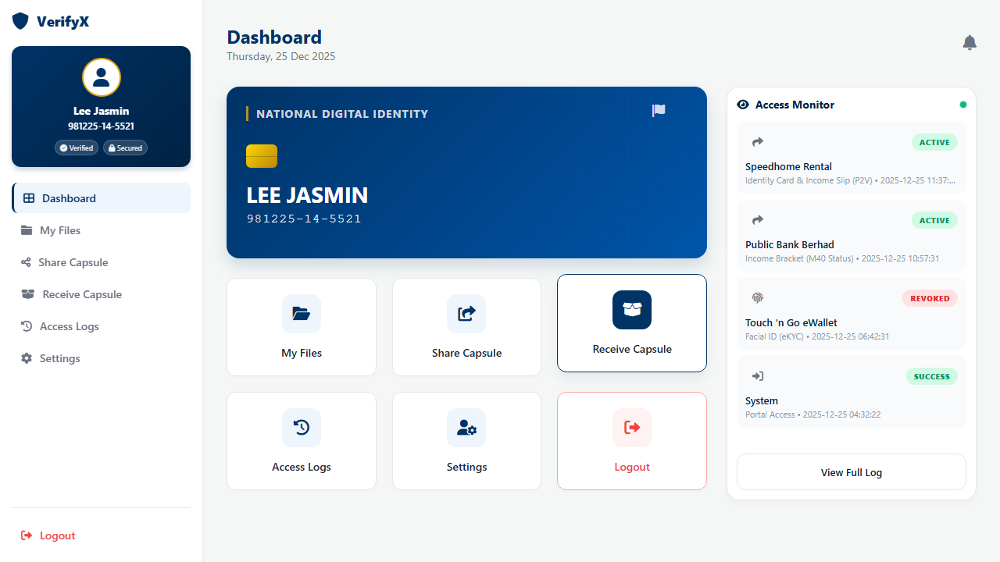
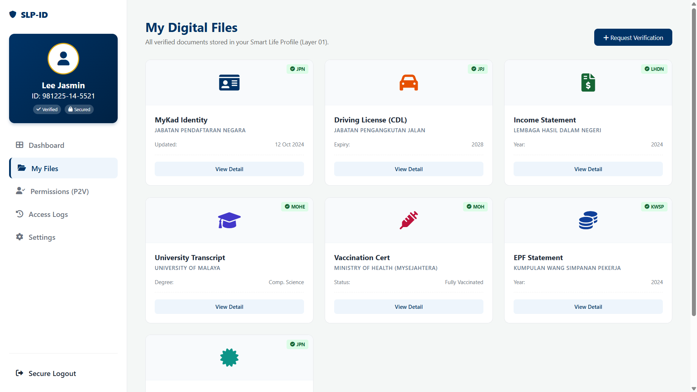
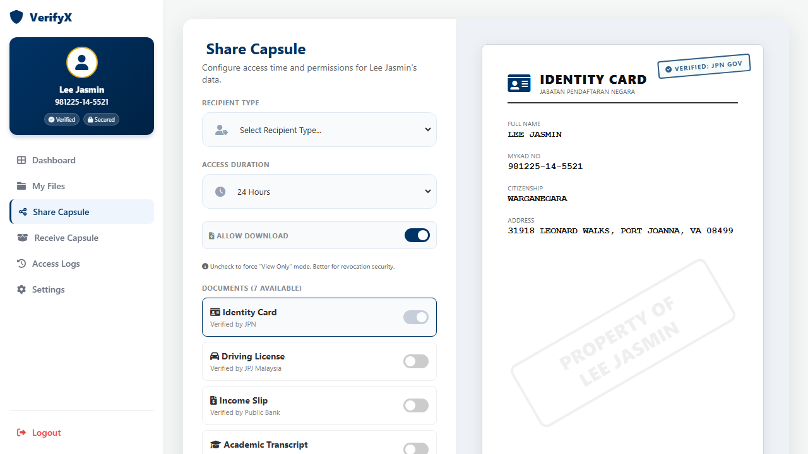
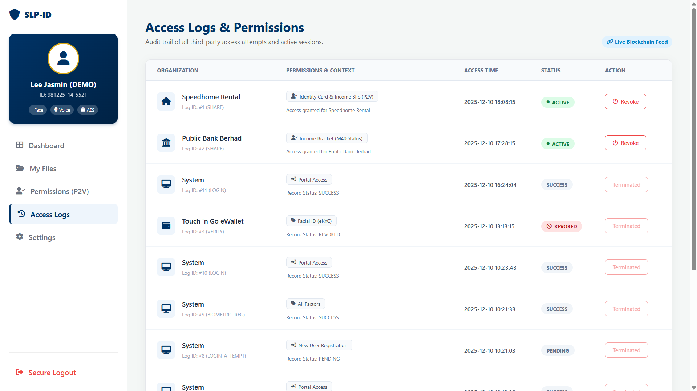
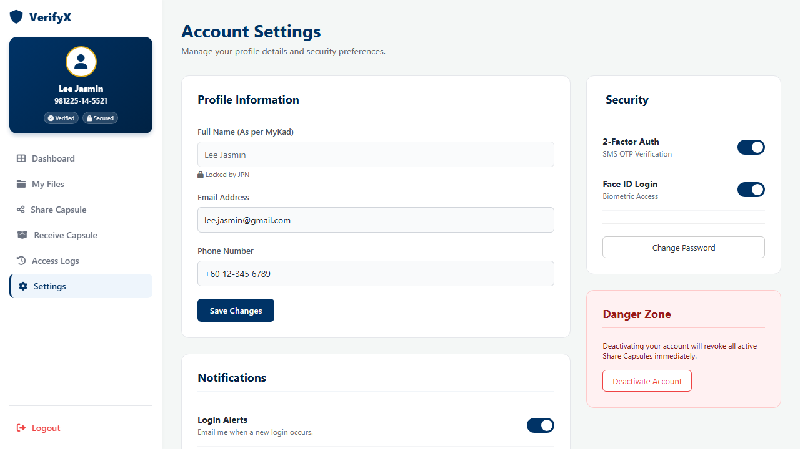

# VerifyX: Smart Life Profile ID (SLP-ID)

## 🛡️ A Multi-Factor Biometric Digital Document Vault

Smart Life Profile ID (SLP-ID) is a cutting-edge web application designed to solve the chronic inefficiency of paper-based document verification in government services. It provides citizens with a single, highly secure, and convenient digital vault for all their essential documents, protected by advanced, multi-layered biometric authentication. **This system being developed is to be considered as a prototype and not as a final product.**

## 💡 The Problem We Solve
In the traditional system, citizens are often required to bring numerous physical documents (IDs, bills, certificates, etc) to government offices or financial institutions.

- **❌ The Hassle:**  Forgetting even one document results in lots of wasted time, long re-queues, and frustrating repeat visits. This is a massive drain on citizen time and organizational efficiency.
- **✅ The Solution:**  Smart Life Profile ID (SLP-ID) centralizes these documents in a highly encrypted vault accessible instantly via a secure web portal, eliminating the need to ever carry physical papers again..

## 🔒 Core Security Features

Secure Liveliness Portal (SLP-ID) employs a powerful 2-of-4 Multi-Factor Biometric Authentication chain, ensuring that only the rightful owner can access their sensitive data.

### 1. Advanced Liveliness Authentication
We go beyond simple facial scans. Every biometric verification step includes Liveliness Detection to prevent fraud and spoofing attempts.

- This system actively verifies that the person presenting the biometric sample is a real, live human being, not a photograph, video replay, or deepfake.

- It protects against unauthorized access using static images or recordings.

### 2. Multi-Factor Biometric Enrollment (MFA)

Users enroll and authenticate using a combination of methods. For vault access, the user must successfully pass **two of the three** chosen biometric verification methods, providing an extra layer of defense beyond traditional 2FA. 

| Biometric Method | Purpose |
| :--- | :--- |
| **Face Recognition** | Enrollment and Verification |
| **Voice Authentication** | Enrollment and Verification |
| **Fingerprint Authentication** | Enrollment and Verification (Available in counter only) |
| **Gesture Recognition** | Enrollment and Verification (User-defined movement patterns) |

### 3. Secure Login and Data Encryption

* **Secure Login:** User credentials are authenticated against industry-standard, securely generated, and salted password hashes using `werkzeug.security`.
* **Encrypted Data:** Core documents are encrypted-at-rest within the database using a cryptographic cipher (e.g., Fernet/AES), ensuring data remains unintelligible even if the database is compromised.

### 4. Transparent Access Logging and Revocation

Every action, whether a user login, an upload, a document share, or a failed authentication attempt, is recorded in a tamper-proof **`access_logs`** table.

* **Audit Trail:** Provides a full chronological audit history of all internal and third-party access attempts.
* **Active Control:** Citizens maintain control over their data and can instantly **revoke** active third-party permissions (P2V tokens) directly from the Access Log dashboard.

---

## 🛠️ System Stack

This system is built using:

* **Backend Framework:** Python / Flask
* **Database:** SQLite (`verifyx.db`) with `sqlite3.Row` for efficient data handling.
* **Security:** `werkzeug.security` for hashing, and custom `Fernet` encryption for document placeholders.
* **Frontend:** HTML5, CSS, Jinja2 templating.

---
# 📄 Application Overview

VerifyX includes core user-facing pages that form the complete secure digital identity and document-sharing experience. As this system is still a prototype, several functions are simulated or partially implemented for demonstration purposes and may not yet reflect full production behavior. Below is an overview of the basic features:


## 🔷 1. Dashboard

The Dashboard is the main hub of the system. It provides a quick overview of the user’s identity details, security verification status, and recent activity.

### **Key Features**
- Digital ID widget with user info  
- Security badges (Face, Voice, AES)  
- Recent alerts and activity  
- Quick access to Files, Permissions, and Logs  




## 🔷 2. My Files (Secure Vault)
The My Files page displays all verified, encrypted documents belonging to the user. Document previews load inside secure modal windows.

### **Key Features**
- List of all verified documents  
- Secure modal preview  
- Agency verification seals  
- Meta details (updated date, issuer, type)




## 🔷 3. Permissions (P2V Share Capsule)

This page allows users to create **Share Capsules**, which grant time-bound, permission-restricted access to third parties.

### **Key Features**
- Choose which documents to share  
- Select recipient organisation  
- Set access start & end times  
- Real-time dynamic preview of each document  
- Submit Share Capsule (logged as ACTIVE)




## 🔷 4. Access Logs

The Access Logs page provides full transparency over how a user’s data is accessed, including real-time revocation controls.

### **Key Features**
- Complete historical audit trail  
- Status indicators (ACTIVE, REVOKED, FAILED, etc.)  
- Organisation icons and access context  
- “Revoke Access” kill switch  
- Instant UI update through AJAX




## 🔷 5. Settings

The Settings page allows users to manage their profile, security preferences, and notification settings.

### **Key Features**
- View locked government-issued fields (e.g., full name)  
- Edit email & phone number  
- Toggle 2FA and biometric login  
- Password change option  
- Account deactivation section (Danger Zone)   




---
## 🚀 Getting Started

To run this project locally and test the features:

### Step 1: Clone the Repository

```bash
# Assuming you have resolved the Git push issue and are ready to push
git clone [https://github.com/EternalEthan06/NextG-GodamLah-2.0-Team-VerifyX.git](https://github.com/EternalEthan06/NextG-GodamLah-2.0-Team-VerifyX.git)

cd NextG-GodamLah-2.0-Team-VerifyX
```
### Step 2: Install all required packages

```bash
pip install -r requirements.txt
```
### Step 3: Setup the Database

You must run the seed.py script once to create the necessary citizens and access_logs tables.

```bash
python data/seed.py
```

### Step 4: Run the Server

```bash
python server.py
```

### Step 5: Access the Portal

Open your browser and navigate to the login page: http://127.0.0.1:5000/login

**Test Credentials:**
- **MyKad: 981225-14-5521**

- **Password: password123**