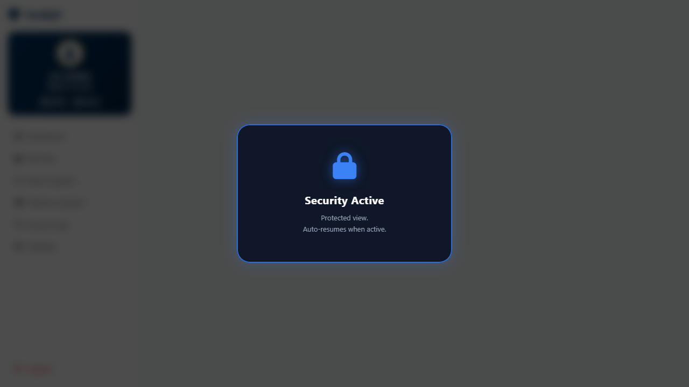
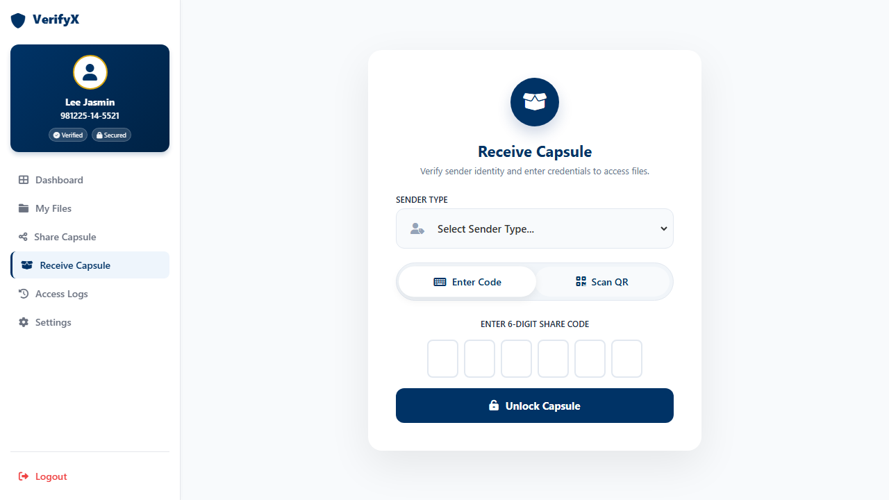
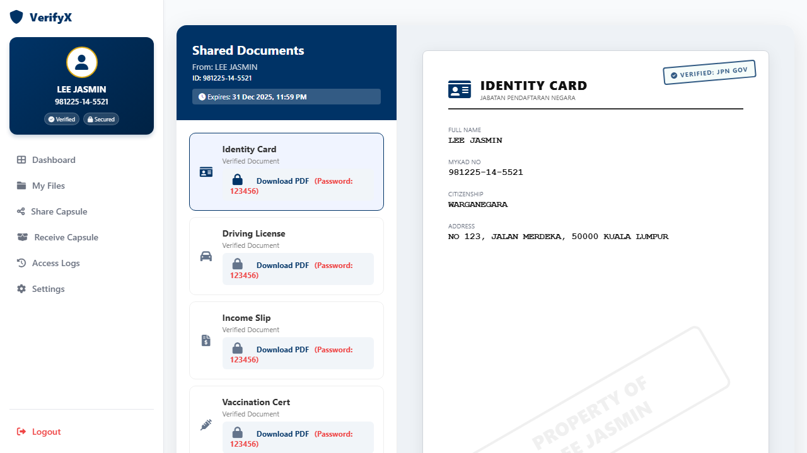
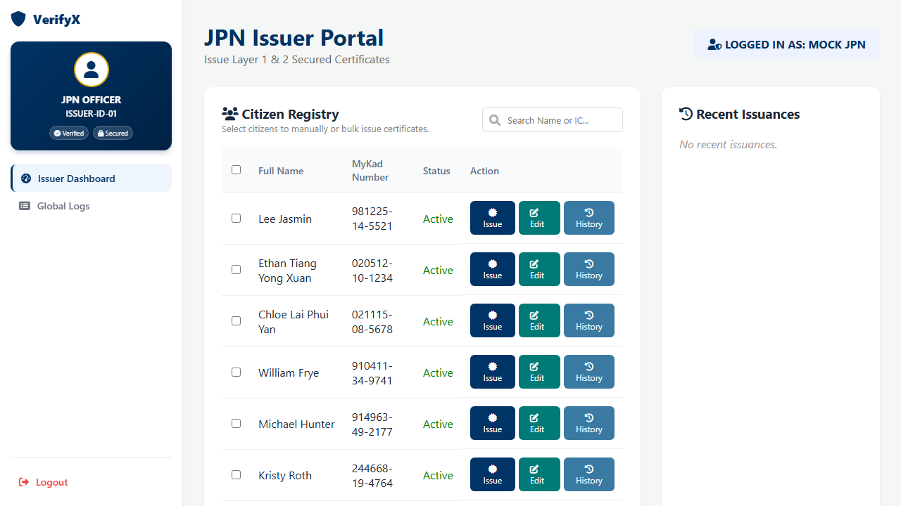
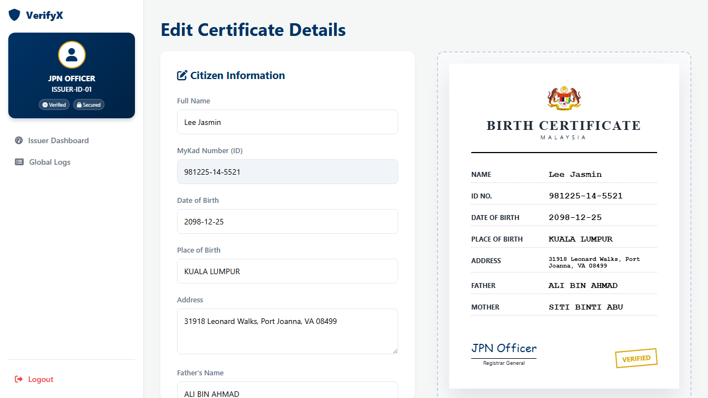

# VerifyX: Smart Life Profile ID (SLP-ID)

## 🛡️ A Multi-Factor Biometric Digital Document Vault

Smart Life Profile ID (SLP-ID) is a cutting-edge web application designed to solve the chronic inefficiency of paper-based document verification in government services. It provides citizens with a single, highly secure, and convenient digital vault for all their essential documents, protected by advanced, multi-layered biometric authentication. **This system being developed is to be considered as a prototype and not as a final product.**

## 💡 The Problem We Solve
In the traditional system, citizens are often required to bring numerous physical documents (IDs, bills, certificates, etc) to government offices or financial institutions.

- **❌ The Hassle:**  Forgetting even one document results in lots of wasted time, long re-queues, and frustrating repeat visits. This is a massive drain on citizen time and organizational efficiency.
- **✅ The Solution:**  Smart Life Profile ID (SLP-ID) centralizes these documents in a highly encrypted vault accessible instantly via a secure web portal, eliminating the need to ever carry physical papers again..

## 🔒 Core Security Features

Secure Liveliness Portal (SLP-ID) employs a powerful 2-of-4 Multi-Factor Biometric Authentication chain, ensuring that only the rightful owner can access their sensitive data.

### 1. Advanced Liveliness Authentication
We go beyond simple facial scans. Every biometric verification step includes Liveliness Detection to prevent fraud and spoofing attempts.

- This system actively verifies that the person presenting the biometric sample is a real, live human being, not a photograph, video replay, or deepfake.
- It protects against unauthorized access using static images or recordings.

### 2. Multi-Factor Biometric Enrollment (MFA)

Users enroll and authenticate using a combination of methods. For vault access, the user must successfully pass **two of the three** chosen biometric verification methods, providing an extra layer of defense beyond traditional 2FA. **The face used for recognition must match the face performing the biometric test.**

| Biometric Method | Purpose |
| :--- | :--- |
| **Face Recognition** | Enrollment and Verification |
| **Voice Authentication** | Enrollment and Verification |
| **Fingerprint Authentication** | Enrollment and Verification (Available in counter only) |
| **Gesture Recognition** | Enrollment and Verification (User-defined movement patterns) |

### 3. Secure Login and Data Encryption

* **Secure Login:** User credentials are authenticated against industry-standard, securely generated, and salted password hashes using `werkzeug.security`.
* **Encrypted Data:** Core documents are encrypted-at-rest within the database using a cryptographic cipher (e.g., Fernet/AES), ensuring data remains unintelligible even if the database is compromised.

### 4. Advanced Backend Security Layers
* **Layer 1: Merkle Anchors:** Implemented for data integrity.
* **Layer 2: Digital Signatures:** Implemented for authenticity verification.

### 5. Transparent Access Logging and Revocation

Every action, whether a user login, an upload, a document share, or a failed authentication attempt, is recorded in a tamper-proof **`access_logs`** table.

* **Audit Trail:** Provides a full chronological audit history of all internal and third-party access attempts.
* **Active Control:** Citizens maintain control over their data and can instantly **revoke** active third-party permissions (P2V tokens) directly from the Access Log dashboard.

---

## 🛠️ System Stack

This system is built using:

* **Backend Framework:** Python / Flask
* **Database:** SQLite (`verifyx.db`) with `sqlite3.Row` for efficient data handling.
* **Security:** `werkzeug.security` for hashing, and custom `Fernet` encryption for document placeholders.
* **Frontend:** HTML5, CSS, Jinja2 templating.

---
# 📄 Application Overview

VerifyX includes core user-facing pages that form the complete secure digital identity and document-sharing experience. As this system is still a prototype, several functions are simulated or partially implemented for demonstration purposes and may not yet reflect full production behavior. Below is an overview of the basic features:


## 🔷 1. Dashboard

The Dashboard is the main hub of the system. It provides a quick overview of the user’s identity details, security verification status, and recent activity.

### **Key Features**
- Digital ID widget with user info  
- Security badges (Face, Voice, AES)  
- Recent alerts and activity  
- Quick access to Files, Permissions, and Logs  


## 🔷 2. My Files (Secure Vault)
The My Files page displays all verified, encrypted documents belonging to the user. Document previews load inside secure modal windows.

### **Key Features**
- List of all verified documents  
- Secure modal preview  
- Agency verification seals  
- Meta details (updated date, issuer, type)
- **Screenshot Lock:** Added mechanism to prevent unauthorized screenshots during viewing.

- **Verify Authenticity:** User can press the "Verify Validity" button from the Merkle anchor to check and receive a verification badge.
    *   **Action:** Server checks the cryptographic signature of the owner against the Issuer Public Key.


## 🔷 3. Share & Receive Capsule (P2V Share Capsule)

This page allows users to create **Share Capsules**, which grant time-bound, permission-restricted access to third parties.

### **Key Features: Share Capsule**
1.  **Select Recipient:** Choose between Individual, Government Department, or Private Agency.
    *   For Individual: Enter IC.
    *   For Agency: Enter Agency Code.
2.  **Select Files:** Choose which documents to share and set access duration.
3.  **Generate Share Capsule:** Create QR code and share code.
    *   **Access Control:** User can select access duration and whether to allow download or restrict to view-only.
4.  **QR Code Display:** Code Generated (Refresh every 60s).
5.  **Multi-File Sharing:** Support for sharing multiple documents in a single capsule.


### **Key Features: Receive Capsule**
1.  **Enter Sender Details:** Enter Sender IC.
2.  **Access Method:** Enter the code or Scan QR.

3.  **Secure Access:** Receiver views a secured PDF locked with a system-generated password (Time-locked: PDF not accessible after the period set in the share capsule).



## 🔷 4. Access Logs

The Access Logs page provides full transparency over how a user’s data is accessed, including real-time revocation controls.

### **Key Features: My Shared Access**
- View shares that were successful.
- History of who accessed/downloaded.

### **Key Features: My Access Control**
- Complete historical audit trail.
- Status indicators (ACTIVE, REVOKED, FAILED, etc.).
- "Revoke Access" kill switch.
- Instant UI update through AJAX.


## 🔷 5. Settings

The Settings page allows users to manage their profile, security preferences, and notification settings.

### **Key Features**
- View locked government-issued fields (e.g., full name)  
- Edit email & phone number  
- Toggle 2FA and biometric login  
- Password change option  
- Account deactivation section (Danger Zone)   


## 🔷 6. Issuer Portal (JPN Mock)

A dedicated portal for "JPN" to issue documents, designed for demonstration purposes. **Note: JPN only issues Birth Certificates for this demo.**

*   **Mock Credentials:**
    *   **MyKad:** `mockjpn`
    *   **Password:** `password123`
*   **Features:**
    *   **Issuer Dashboard:** Search and Bulk Issuance.
    *   **Edit Certificate:** Page with live preview.
    *   **Logs:** History log and action log.
    *   *Issuer login bypasses biometric checks for this demo.*

### **Security Implementation (Layer 1 & 2)**
*   **Layer 1 (Merkle Anchors):** Ensures data integrity by anchoring document hashes to a Merkle Tree. Any alteration to the document content invalidates the anchor.
*   **Layer 2 (Digital Signatures):** Ensures authenticity. Documents are cryptographically signed by the issuer (JPN) using their private key. The "Verify Validity" feature verifies this signature against the issuer's public key to confirm the document's origin.  


---
## 🚀 Getting Started

To run this project locally and test the features:

### Step 1: Clone the Repository

```bash
git clone https://github.com/EternalEthan06/NextG-GodamLah-2.0-Team-VerifyX.git

cd NextG-GodamLah-2.0-Team-VerifyX
```
### Step 2: Install all required packages

```bash
pip install -r requirements.txt
```
### Step 3: Setup the Database

You must run the seed.py script once to create the necessary citizens and access_logs tables.

```bash
python data/seed.py
```

### Step 4: Run the Server

```bash
python server.py
```

### Step 5: Access the Portal

Open your browser and navigate to the login page: http://127.0.0.1:5000/login

**Test Credentials:**
- **User Login:**
    - **MyKad:** 981225-14-5521
    - **Password:** password123

- **Issuer (JPN) Login:**
    - **MyKad:** mockjpn
    - **Password:** password123

---
**Authors:**
- Lee Jasmin
- Ethan Tiang Yong Xuan
- Chloe Lai Phui Yan